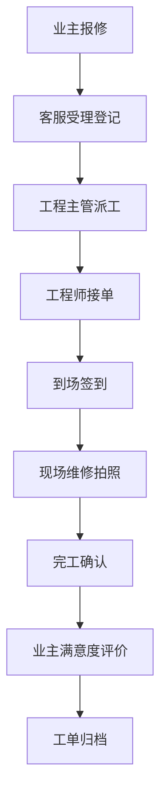
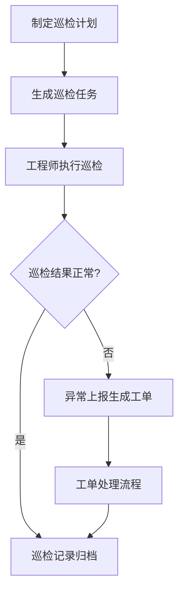

# 社区公共设施设备运维管理系统 PRD

## 1. 产品概述

社区公共设施设备运维 Web 应用是面向物业工程部的一站式设备运维管理平台，实现门禁、道闸、电梯外呼屏、水泵、照明、监控等设施设备的全生命周期管理，提升运维效率，降低管理成本。

- **目标用户**：物业工程管理人员、维修工程师、物业管理层
- **核心价值**：设备资产数字化、运维流程标准化、数据决策智能化

## 2. 核心功能

### 2.1 用户角色

| 角色 | 核心权限 |
|------|----------|
| 系统管理员 | 全功能权限，用户管理，系统配置 |
| 工程主管 | 工单派工、排班管理、数据分析、审批流程 |
| 维修工程师 | 工单接收、签到维修、巡检执行、拍照上传 |
| 物业经理 | 数据看板、费用审批、供应商管理、满意度查看 |

### 2.2 功能模块

1. **工作台**：运营数据看板、待办事项、快捷操作入口
2. **设备档案**：小区设备分布图、资产二维码管理、设备详情台账、设备分类管理
3. **工单处理**：报修受理、派工排班、到场签到、维修过程拍照、超时催办
4. **巡检保养**：巡检清单管理、保养周期设置、巡检记录、保养提醒
5. **公告通知**：停机公告发布、业主通知推送、满意度回访
6. **费用备件**：费用分摊计算、供应商评价、备品备件库存管理
7. **数据分析**：设备寿命评估、运营数据统计、故障分析报表

### 2.3 页面详情

| 页面名称 | 模块名称 | 功能描述 |
|-----------|-------------|---------------------|
| 工作台 | 运营看板 | 设备总数、在线率、待处理工单、今日巡检等关键指标卡片 |
| 工作台 | 待办事项 | 待派工、待处理、超时工单列表展示 |
| 工作台 | 快捷入口 | 常用功能快速导航按钮 |
| 设备档案 | 设备分布图 | 小区平面图展示，设备点位标注，点击查看详情 |
| 设备档案 | 设备列表 | 按类型/状态筛选，搜索，分页展示设备台账 |
| 设备档案 | 设备详情 | 设备基本信息、二维码、维修历史、巡检记录、保养记录 |
| 工单处理 | 报修受理 | 新增报修单、业主报修列表、问题分类 |
| 工单处理 | 派工排班 | 工单分配、工程师排班表、工时统计 |
| 工单处理 | 现场处理 | 到场签到、维修拍照、备件使用、完工确认 |
| 工单处理 | 超时催办 | 超时工单提醒、自动催办通知 |
| 巡检保养 | 巡检清单 | 巡检路线、检查项列表、巡检结果录入 |
| 巡检保养 | 保养周期 | 保养计划配置、周期提醒、保养记录 |
| 公告通知 | 停机公告 | 设备停机计划、公告发布、业主可见范围设置 |
| 公告通知 | 业主通知 | 通知模板、批量推送、发送记录 |
| 公告通知 | 满意度回访 | 维修后回访问卷、满意度统计 |
| 费用备件 | 费用分摊 | 公共维修费用计算、分摊明细、审批流程 |
| 费用备件 | 供应商管理 | 供应商信息、服务评价、合作记录 |
| 费用备件 | 备品备件 | 库存管理、出入库记录、低库存预警 |
| 数据分析 | 寿命评估 | 设备剩余寿命预测、更换建议、老化分析 |
| 数据分析 | 运营看板 | 故障趋势、维修成本、工单完成率、设备使用率图表 |

## 3. 核心流程

### 3.1 报修处理流程

业主报修 → 客服受理 → 工程主管派工 → 工程师接单 → 到场签到 → 现场维修拍照 → 完工确认 → 业主评价 → 工单归档

### 3.2 巡检保养流程

制定巡检计划 → 生成巡检任务 → 工程师执行巡检 → 异常上报 → 生成工单 → 处理闭环

## 4. 用户界面设计

### 4.1 设计风格

- **主色调**：深蓝色 #1e40af（专业、可靠），辅助色：青色 #0891b2（科技感）
- **强调色**：橙色 #f97316（告警、提醒），绿色 #10b981（正常、完成）
- **中性色**： slate 色系，确保良好的可读性和层次感
- **按钮风格**：圆角 6px，轻微阴影，hover 状态有背景色加深和上浮动效
- **字体**：标题使用 Noto Sans SC 600，正文使用 Noto Sans SC 400，数值使用等宽字体
- **布局风格**：左侧导航栏 + 顶部状态栏 + 内容区域卡片式布局
- **图标**：使用 lucide-react 线性图标，保持统一风格

### 4.2 页面设计概述

| 页面名称 | 模块名称 | UI 元素 |
|-----------|-------------|-------------|
| 工作台 | 运营看板 | 数据卡片网格，渐变背景，数字动画效果，进度环图表 |
| 工作台 | 待办列表 | 列表项带状态标签，悬停效果，优先级角标 |
| 设备档案 | 设备分布图 | 交互式平面图，设备点位图标，悬停气泡提示，缩放平移 |
| 设备档案 | 设备列表 | 表格布局，筛选器，搜索框，状态列带彩色圆点 |
| 工单处理 | 工单详情 | 步骤条展示处理进度，时间线记录，照片缩略图网格 |
| 巡检保养 | 巡检清单 | 勾选框列表，备注输入，拍照上传按钮 |
| 数据分析 | 图表看板 | 多种图表类型（折线图、柱状图、饼图），时间筛选器 |

### 4.3 响应式设计

- 采用桌面端优先设计，主内容区最小宽度 1280px
- 侧边栏可折叠，适配不同屏幕尺寸
- 表格在小屏幕下支持横向滚动
- 触控设备优化按钮尺寸，最小点击区域 44px

