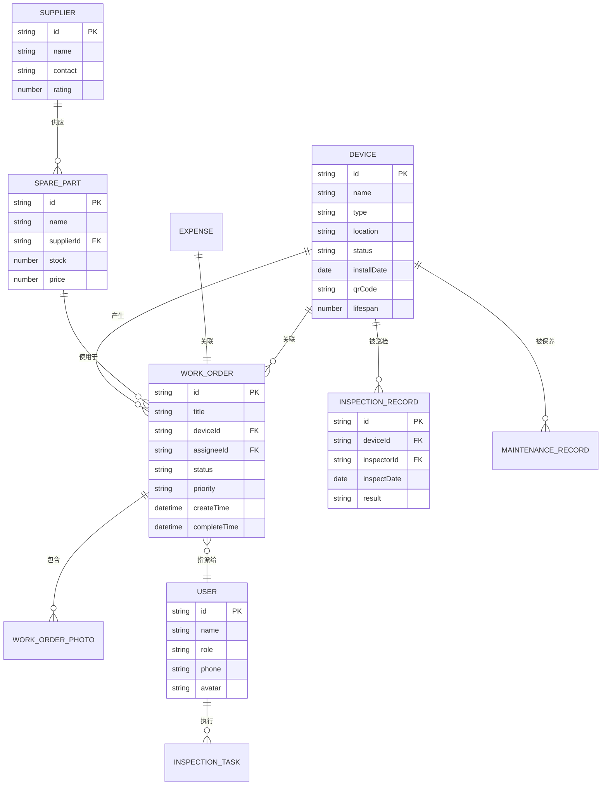

# 社区公共设施设备运维管理系统 技术架构文档

## 1. 架构设计

```mermaid
graph TB
    subgraph "前端层 (React + TypeScript)"
        A["页面层 (7个主页面)"]
        B["组件层 (通用组件)"]
        C["状态管理 (Zustand)"]
        D["路由 (React Router)"]
    end

    subgraph "后端层 (Express + TypeScript)"
        E["API 路由层"]
        F["业务逻辑层 (Services)"]
        G["数据访问层"]
    end

    subgraph "数据层"
        H["模拟数据 (Mock Data)"]
        I["本地存储 (LocalStorage)"]
    end

    subgraph "外部服务"
        J["图表库 (Recharts)"]
        K["二维码生成"]
        L["地图/平面图展示"]
    end

    A --> B
    A --> D
    B --> C
    C --> E
    E --> F
    F --> G
    G --> H
    G --> I
    A --> J
    A --> K
    A --> L
```



## 2. 技术描述

- **前端框架**: React@18 + TypeScript
- **构建工具**: Vite@5
- **路由管理**: react-router-dom@6
- **状态管理**: zustand@4
- **样式方案**: Tailwind CSS@3 + CSS Variables
- **UI 组件**: 自定义组件 + lucide-react 图标库
- **图表库**: recharts@2
- **后端框架**: Express@4 + TypeScript
- **HTTP 客户端**: fetch API (原生)
- **二维码**: qrcode.react 或纯前端生成
- **数据方案**: 前端 Mock 数据 + LocalStorage 持久化

## 3. 路由定义

| 路由路径 | 页面组件 | 功能说明 |
|----------|----------|----------|
| `/` | Dashboard | 工作台 - 运营看板、待办事项 |
| `/devices` | DeviceList | 设备档案 - 设备列表、分布图 |
| `/devices/:id` | DeviceDetail | 设备详情页 |
| `/workorders` | WorkOrderList | 工单处理 - 工单列表 |
| `/workorders/:id` | WorkOrderDetail | 工单详情页 |
| `/workorders/create` | WorkOrderCreate | 新建报修单 |
| `/inspection` | Inspection | 巡检保养 - 巡检清单、保养周期 |
| `/notices` | NoticeList | 公告通知 - 停机公告、业主通知 |
| `/expenses` | ExpenseParts | 费用备件 - 费用分摊、备品备件 |
| `/analytics` | Analytics | 数据分析 - 运营看板、寿命评估 |

## 4. 数据模型

### 4.1 核心实体关系图



### 4.2 设备类型定义

```typescript
// 设备类型
type DeviceType = 'access_control' | 'gate' | 'elevator_screen' | 'water_pump' | 'lighting' | 'monitor';

interface Device {
  id: string;
  name: string;
  type: DeviceType;
  typeName: string;
  location: string;
  building: string;
  status: 'normal' | 'warning' | 'fault' | 'maintenance';
  installDate: string;
  lifespan: number;
  manufacturer: string;
  model: string;
  qrCode: string;
  lastMaintenanceDate: string;
  nextMaintenanceDate: string;
  description: string;
  position: { x: number; y: number };
}

// 工单类型
type WorkOrderStatus = 'pending' | 'assigned' | 'in_progress' | 'completed' | 'closed';
type WorkOrderPriority = 'low' | 'medium' | 'high' | 'urgent';

interface WorkOrder {
  id: string;
  title: string;
  description: string;
  deviceId: string;
  deviceName: string;
  reporter: string;
  reporterPhone: string;
  assigneeId: string | null;
  assigneeName: string | null;
  status: WorkOrderStatus;
  priority: WorkOrderPriority;
  createTime: string;
  assignTime: string | null;
  checkInTime: string | null;
  completeTime: string | null;
  photos: string[];
  remark: string;
  cost: number;
}

// 用户类型
type UserRole = 'admin' | 'supervisor' | 'engineer' | 'manager';

interface User {
  id: string;
  name: string;
  role: UserRole;
  phone: string;
  email: string;
  avatar: string;
}

// 巡检类型
interface InspectionTask {
  id: string;
  title: string;
  route: string;
  devices: string[];
  assigneeId: string;
  scheduleDate: string;
  status: 'pending' | 'in_progress' | 'completed';
  items: InspectionItem[];
}

interface InspectionItem {
  id: string;
  deviceId: string;
  checkItem: string;
  result: 'normal' | 'abnormal' | null;
  remark: string;
}

// 备件类型
interface SparePart {
  id: string;
  name: string;
  category: string;
  supplierId: string;
  supplierName: string;
  stock: number;
  minStock: number;
  unit: string;
  price: number;
}

// 供应商类型
interface Supplier {
  id: string;
  name: string;
  contact: string;
  phone: string;
  address: string;
  rating: number;
  serviceCount: number;
}
```

## 5. 项目目录结构

```
.
├── src/                          # 前端源码
│   ├── components/              # 通用组件
│   │   ├── layout/          # 布局组件 (Sidebar, Header, Layout)
│   │   ├── ui/              # 基础UI组件 (Button, Card, Table, Modal等
│   │   └── charts/         # 图表组件
│   ├── pages/              # 页面组件
│   │   ├── Dashboard/      # 工作台
│   │   ├── Devices/      # 设备档案
│   │   ├── WorkOrders/  # 工单处理
│   │   ├── Inspection/    # 巡检保养
│   │   ├── Notices/     # 公告通知
│   │   ├── ExpenseParts/ # 费用备件
│   │   └── Analytics/   # 数据分析
│   ├── store/              # Zustand 状态管理
│   ├── types/              # TypeScript 类型定义
│   ├── utils/             # 工具函数
│   ├── mock/              # 模拟数据
│   ├── assets/             # 静态资源
│   ├── App.tsx
│   ├── main.tsx
│   └── index.css
├── api/                      # 后端源码 (Express)
│   ├── routes/           # API 路由
│   ├── controllers/      # 控制器
│   ├── data/          # 数据
│   └── index.ts
├── shared/                 # 共享类型定义
├── vite.config.ts
├── tailwind.config.js
├── tsconfig.json
└── package.json
```

